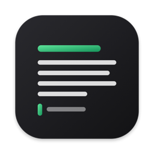

<p align="right"><a href="README.md">Português</a> · <b>English</b></p>

# GonService · Homebrew and downloads

[GonService](https://gonserviceit.com.br) apps, installable with
[Homebrew](https://brew.sh) on macOS or as direct downloads for Windows and Linux.

## Download Reader



**Reader** — reads and edits markdown, text and code; reads PDF and Word.
[See screenshots and how to use it →](reader/README.en.md)
<br clear="left">

<!-- downloads:reader -->
| System | Download |
|---|---|
| macOS, with Homebrew | `brew install --cask gonservice/tap/reader-app` |
| macOS (Intel and Apple Silicon) | [Reader-1.0.0-macos.zip](https://github.com/GonService/homebrew-tap/releases/download/reader-v1.0.0/Reader-1.0.0-macos.zip) |
| Windows | [Installer (.exe)](https://github.com/GonService/homebrew-tap/releases/download/reader-v1.0.0/Reader-1.0.0-windows-instalador.exe) · [.zip, no install](https://github.com/GonService/homebrew-tap/releases/download/reader-v1.0.0/Reader-1.0.0-windows.zip) |
| Linux | [Reader-1.0.0-linux-amd64.tar.gz](https://github.com/GonService/homebrew-tap/releases/download/reader-v1.0.0/Reader-1.0.0-linux-amd64.tar.gz) |

Current version: **1.0.0** · [all versions](https://github.com/GonService/homebrew-tap/releases)
<!-- /downloads:reader -->

## Apps

| | App | What it does | Install on Mac |
|---|---|---|---|
|  | **[Reader](reader/README.en.md)** | Reads and edits markdown, text and code; reads PDF and Word. | `brew install --cask gonservice/tap/reader-app` |

Each app has its own folder here, with screenshots and usage instructions.

## Install on Mac (Homebrew)

With [Homebrew](https://brew.sh) installed, each app is one command (see the
table above). To update everything that came from here:

```bash
brew upgrade --cask $(brew list --cask --full-name | grep '^gonservice/')
```

## Download for Windows and Linux

Installers are on the **[Releases](https://github.com/GonService/homebrew-tap/releases)**
page, one release per app version (the tag starts with the app name, e.g.
`reader-v1.0.0`). Each release lists which file to download for each system.

## About this repository

- `Casks/` — the Homebrew recipes. They're updated automatically with every
  new app version; don't edit them by hand.
- One folder per app (`reader/`, …) — what it does, screenshots and how to use it.
- The apps' source code lives in private GonService repositories; this one
  only holds the installers and the documentation.

The apps are free and aren't signed with a paid Apple or Microsoft
certificate. Through Homebrew you won't notice; when downloading directly, the
system asks for a confirmation the first time you open the app — each app's
folder explains how.
