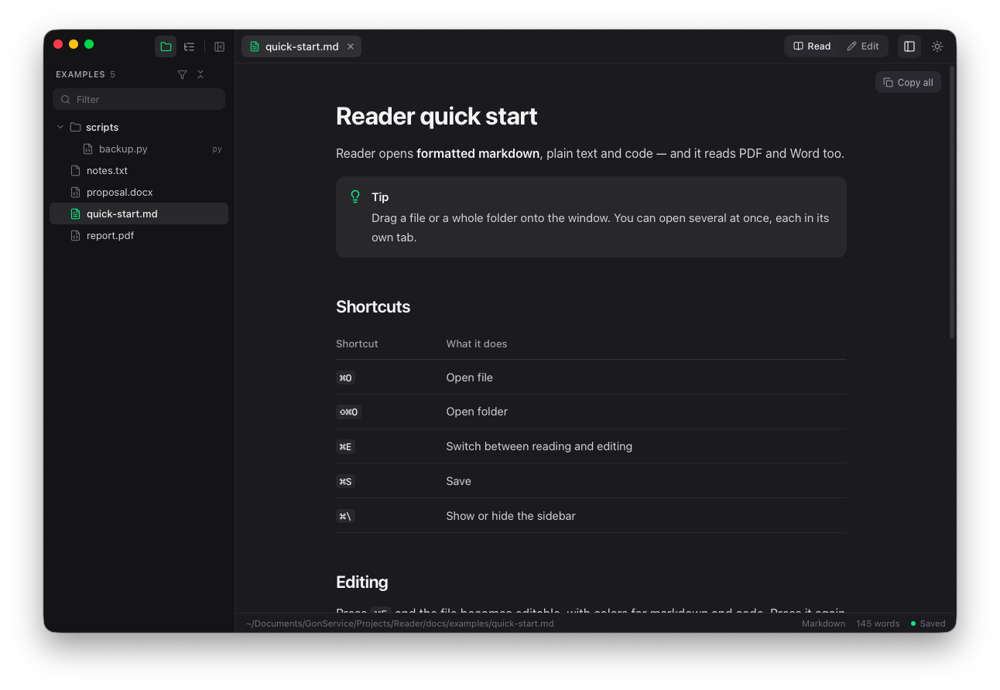
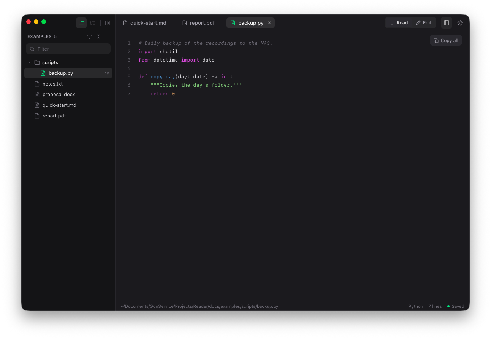
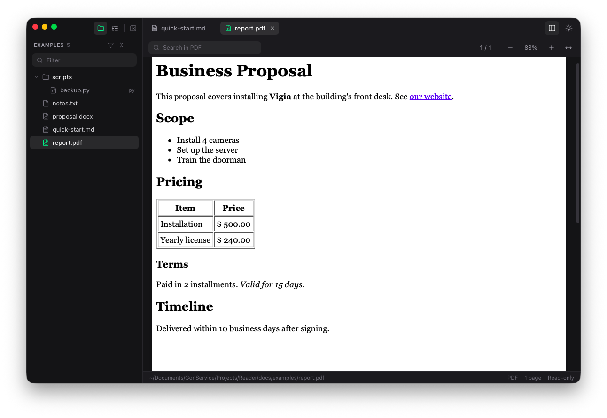
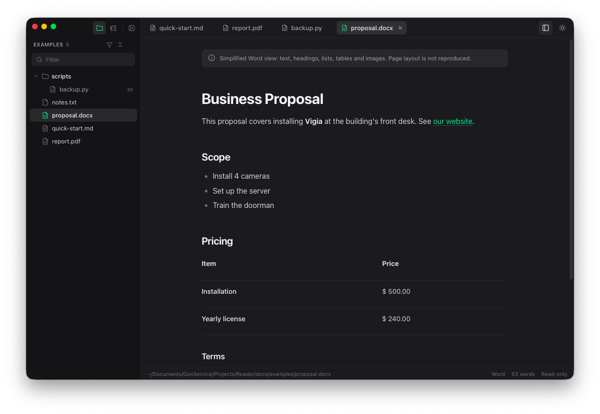
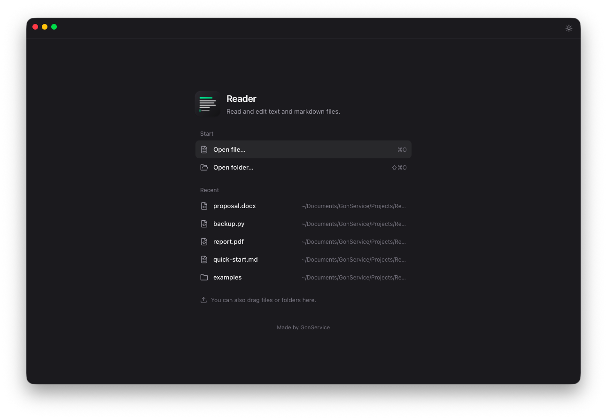

<p align="right"><a href="README.md">Português</a> · <b>English</b></p>

<p align="center">
  
</p>

<h1 align="center">Reader</h1>

<p align="center">
  A reader and editor for markdown, text and code — that also reads PDF and Word.<br>
  Made by <a href="https://gonserviceit.com.br">GonService</a>. Free, for macOS, Windows and Linux.
</p>

<p align="center">
  
</p>

## Why it exists

Opening a `.md` in the system's text editor shows asterisks, hash signs and
misaligned tables. Reader opens the file **formatted**, with a double click,
and lets you edit it in the same place. It's also handy for browsing a whole
folder of documentation, reading code with syntax colors and taking a quick
look at PDF and Word files.

## Install

### macOS

With [Homebrew](https://brew.sh):

```bash
brew install --cask gonservice/tap/reader-app
```

To update: `brew upgrade --cask reader-app`. Works on Intel and Apple Silicon
Macs (macOS 11 or later).

The package is called `reader-app` because `reader` is already another app's
name on Homebrew (Readwise Reader). Once installed, it shows up as **Reader**.

Prefer not to use Homebrew? Download `Reader-X.Y.Z-macos.zip` from the
[Releases page](https://github.com/GonService/homebrew-tap/releases), unzip it
and drag **Reader** to Applications. The first time, right-click the app →
**Open** (see [why](#macos-or-windows-says-the-app-isnt-verified)).

### Windows

Download **`Reader-X.Y.Z-windows-instalador.exe`** from the
[Releases page](https://github.com/GonService/homebrew-tap/releases) and run
it. If "Windows protected your PC" shows up, click **More info → Run anyway**.

There's also a `.zip` with just `Reader.exe`, if you'd rather not install.

### Linux

Download `Reader-X.Y.Z-linux-amd64.tar.gz`, extract it and run `./Reader`. It
needs the WebKit library, which desktop distributions already ship; if it's
missing:

```bash
sudo apt install libwebkit2gtk-4.1-0      # Ubuntu / Debian
sudo dnf install webkit2gtk4.1            # Fedora
```

## What it opens

| File | How it's shown | Editable? |
|---|---|---|
| Markdown (`.md`) | Formatted: headings, tables, task lists, code blocks with colors, images, GitHub alerts | Yes |
| Text (`.txt`, `.log`) | Plain text — including old files saved by Windows Notepad | Yes |
| Code (`.py`, `.go`, `.php`, `.js`, `.sql`, `.json`…) | Line numbers and syntax colors | Yes |
| PDF | Pages, search, zoom and the PDF's own table of contents | Read-only |
| Word (`.docx`) | Flowing document: headings, lists, tables and images | Read-only |

<table>
  <tr>
    <td></td>
    <td></td>
  </tr>
  <tr>
    <td align="center"><sub>Code with colors and line numbers</sub></td>
    <td align="center"><sub>PDF with search, zoom and page count</sub></td>
  </tr>
  <tr>
    <td></td>
    <td></td>
  </tr>
  <tr>
    <td align="center"><sub>Word as a flowing document</sub></td>
    <td align="center"><sub>Home screen with recent files</sub></td>
  </tr>
</table>

## How to use it

- **Open:** double-click a `.md` (Reader can be the default app), drag files or
  folders onto the window, or press `⌘O` / `⇧⌘O`.
- **Folder:** open a folder to see its file tree in the sidebar. The funnel
  shows only documents (`.md`, `.txt`, `.pdf`, `.docx`); the *Filter* field
  finds files by name.
- **Outline:** the list icon, next to the folder icon, shows the document's
  headings. Click one to jump to that section; the small arrow collapses its
  subsections.
- **Edit:** `⌘E` switches between reading and editing. `⌘S` saves. The file
  goes back to disk the way it was — same encoding and same line endings.
- **Changed elsewhere?** If another program changes the file, Reader reloads
  it on its own. If you had changes too, it asks which version to keep.
- **Copy:** *Copy all* copies the whole file; `⌘A` selects only the document,
  not the window.
- **Language:** Portuguese or English, under *View → Language*. On automatic,
  it follows the system language.

### Shortcuts

| Mac | Windows / Linux | What it does |
|---|---|---|
| `⌘O` | `Ctrl+O` | Open file |
| `⇧⌘O` | `Ctrl+Shift+O` | Open folder |
| `⌘E` | `Ctrl+E` | Read / Edit |
| `⌘S` | `Ctrl+S` | Save |
| `⌘W` | `Ctrl+W` | Close tab |
| `⇧⌘]` / `⇧⌘[` | `Ctrl+Shift+]` / `[` | Next / previous tab |
| `⌘\` | `Ctrl+\` | Show / hide the sidebar |
| `⌘+` / `⌘−` / `⌘0` | `Ctrl` + `+` / `−` / `0` | Text size |
| `⇧⌘T` | `Ctrl+Shift+T` | Light / dark theme |
| `⌘F` | `Ctrl+F` | Search (in PDFs and in Edit mode) |

## FAQ

### macOS (or Windows) says the app isn't verified

Reader isn't signed with a paid Apple or Microsoft certificate — it's free and
will stay that way. Through Homebrew you won't see this. When downloading
directly:

- **Mac:** right-click Reader → **Open** → **Open**. Only the first time. If
  the option doesn't show up, go to *System Settings → Privacy & Security* and
  click **Open Anyway**.
- **Windows:** **More info → Run anyway**.

### How do I make Reader open my `.md` files on double-click?

On Mac: right-click a `.md` → **Get Info** → *Open with:* **Reader** →
**Change All…**. On Windows: right-click → **Open with** → **Choose another
app** → Reader, and tick *Always use this app*.

### Can it edit PDFs?

No, on purpose: a PDF doesn't store paragraphs, and no free tool edits "any
PDF" without breaking the layout. Reader reads PDF and Word; to edit them, use
the program the document came from.

### Does my data go anywhere?

No. Reader works 100% offline: it only reads and writes the files you open.
All it keeps is your recent files list and your preferences (language,
theme), on your own computer.

---

<sub>© 2026 GonService. Built with Go, Wails, React, pdf.js and mammoth.</sub>
