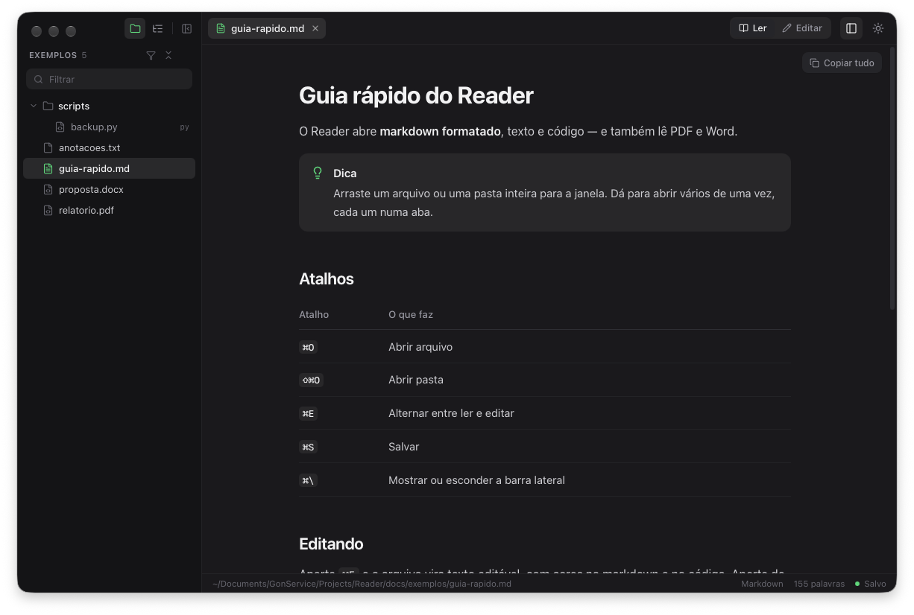
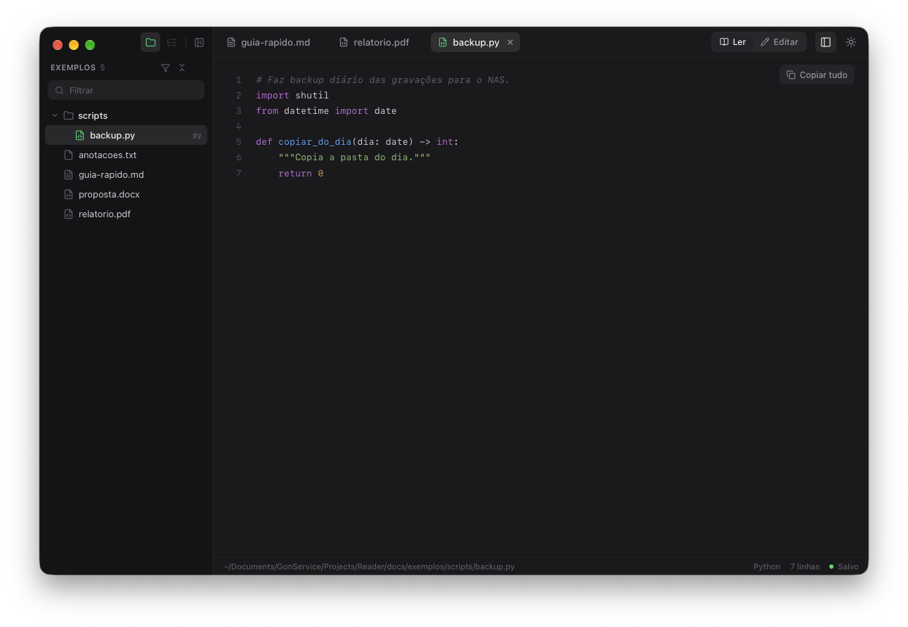
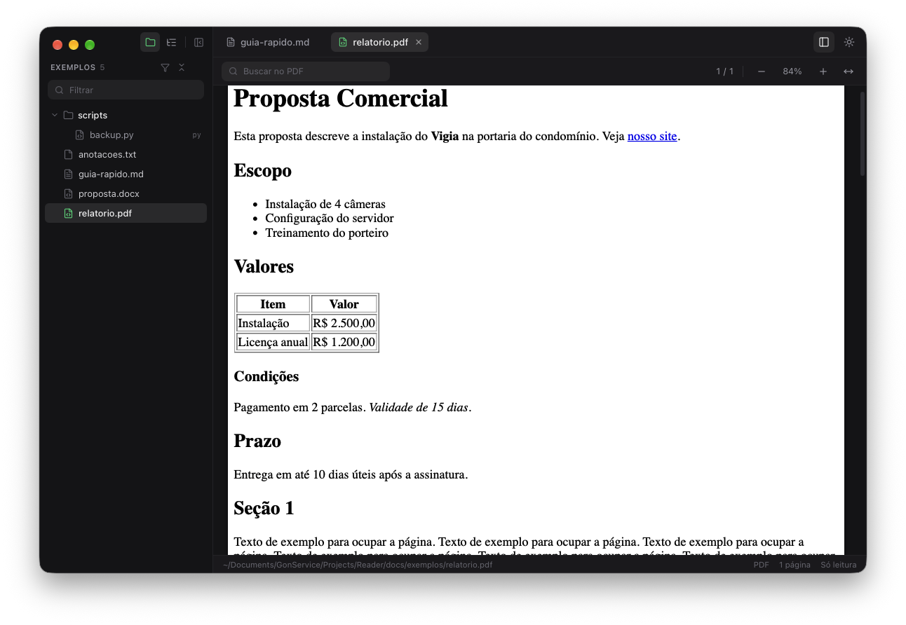
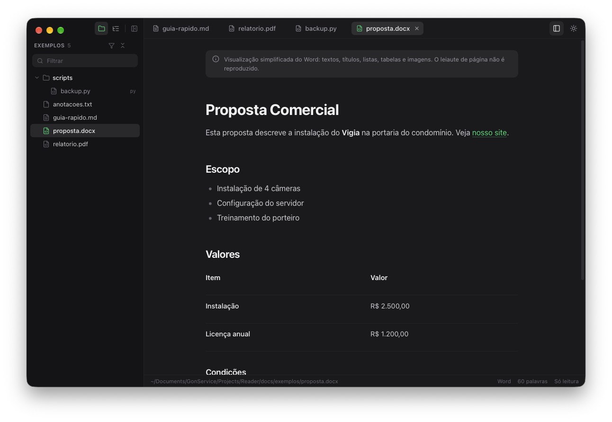
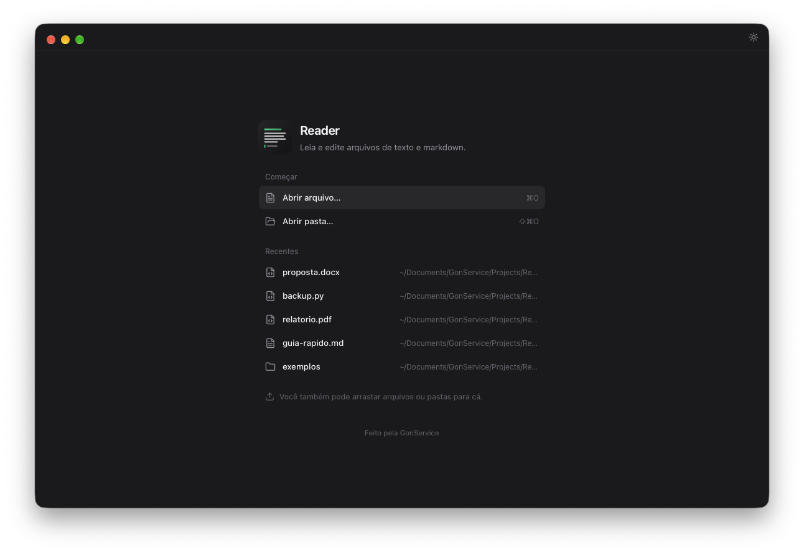

<p align="center">
  
</p>

<h1 align="center">Reader</h1>

<p align="center">
  Leitor e editor de markdown, texto e código — que também lê PDF e Word.<br>
  Feito pela <a href="https://gonserviceit.com.br">GonService</a>. Gratuito, para macOS, Windows e Linux.
</p>

<p align="center">
  
</p>

## Por que existe

Abrir um `.md` no editor de texto do sistema mostra asteriscos, cerquilhas e
tabelas desalinhadas. O Reader abre o arquivo **formatado**, com duplo clique,
e deixa editar no mesmo lugar. Serve também para navegar por uma pasta inteira
de documentação, ler código com cores e dar uma olhada rápida em PDF e Word.

## Instalar

### macOS

Com o [Homebrew](https://brew.sh):

```bash
brew install --cask gonservice/tap/reader
```

Para atualizar: `brew upgrade --cask gonservice/tap/reader`. Funciona em Mac
Intel e Apple Silicon (macOS 11 ou mais novo).

> [!IMPORTANT]
> Use sempre o nome completo **`gonservice/tap/reader`**. O Homebrew oficial
> tem outro app chamado `reader` (o Readwise Reader), e `brew install --cask reader`
> instala aquele, não este.

Prefere sem Homebrew? Baixe o `Reader-X.Y.Z-macos.zip` na
[página de Releases](https://github.com/GonService/homebrew-tap/releases),
descompacte e arraste o **Reader** para Aplicativos. Na primeira vez, clique
com o botão direito no app → **Abrir** (veja [por quê](#o-mac-ou-o-windows-diz-que-o-app-não-é-verificado)).

### Windows

Baixe o **`Reader-X.Y.Z-windows-instalador.exe`** na
[página de Releases](https://github.com/GonService/homebrew-tap/releases) e
execute. Se aparecer "O Windows protegeu o computador", clique em
**Mais informações → Executar assim mesmo**.

Também há um `.zip` com só o `Reader.exe`, para usar sem instalar.

### Linux

Baixe o `Reader-X.Y.Z-linux-amd64.tar.gz`, descompacte e rode `./Reader`.
Precisa da biblioteca do WebKit, que já vem nas distribuições com interface
gráfica; se faltar:

```bash
sudo apt install libwebkit2gtk-4.1-0      # Ubuntu / Debian
sudo dnf install webkit2gtk4.1            # Fedora
```

## O que ele abre

| Arquivo | Como aparece | Edita? |
|---|---|---|
| Markdown (`.md`) | Formatado: títulos, tabelas, listas de tarefas, blocos de código com cores, imagens, alertas do GitHub | Sim |
| Texto (`.txt`, `.log`) | Texto corrido — inclusive os antigos, salvos no Bloco de Notas | Sim |
| Código (`.py`, `.go`, `.php`, `.js`, `.sql`, `.json`…) | Números de linha e cores | Sim |
| PDF | Páginas, busca, zoom e o índice do PDF | Só leitura |
| Word (`.docx`) | Documento corrido: títulos, listas, tabelas e imagens | Só leitura |

<table>
  <tr>
    <td></td>
    <td></td>
  </tr>
  <tr>
    <td align="center"><sub>Código com cores e números de linha</sub></td>
    <td align="center"><sub>PDF com busca, zoom e contagem de páginas</sub></td>
  </tr>
  <tr>
    <td></td>
    <td></td>
  </tr>
  <tr>
    <td align="center"><sub>Word como documento corrido</sub></td>
    <td align="center"><sub>Tela inicial com os recentes</sub></td>
  </tr>
</table>

## Como usar

- **Abrir:** duplo clique num `.md` (o Reader pode ser o app padrão), arrastar
  arquivos ou pastas para a janela, ou `⌘O` / `⇧⌘O`.
- **Pasta:** abra uma pasta para ver a árvore de arquivos na barra lateral. O
  funil mostra só documentos (`.md`, `.txt`, `.pdf`, `.docx`); o campo
  *Filtrar* acha arquivos pelo nome.
- **Sumário:** o ícone de lista, ao lado do de pasta, mostra os títulos do
  documento. Clique para ir até a seção; a setinha recolhe as subseções.
- **Editar:** `⌘E` alterna entre ler e editar. `⌘S` salva. O arquivo volta ao
  disco do jeito que estava — mesma codificação e mesmas quebras de linha.
- **Mudou por fora?** Se outro programa alterar o arquivo, o Reader recarrega
  sozinho. Se você também tinha alterações, ele pergunta qual versão manter.
- **Copiar:** *Copiar tudo* copia o arquivo inteiro; `⌘A` seleciona só o
  documento, não a janela.
- **Idioma:** português ou inglês, em *Exibir → Idioma*. No automático, segue
  o idioma do sistema.

### Atalhos

| Atalho (Mac) | Windows / Linux | O que faz |
|---|---|---|
| `⌘O` | `Ctrl+O` | Abrir arquivo |
| `⇧⌘O` | `Ctrl+Shift+O` | Abrir pasta |
| `⌘E` | `Ctrl+E` | Ler / Editar |
| `⌘S` | `Ctrl+S` | Salvar |
| `⌘W` | `Ctrl+W` | Fechar aba |
| `⇧⌘]` / `⇧⌘[` | `Ctrl+Shift+]` / `[` | Próxima / aba anterior |
| `⌘\` | `Ctrl+\` | Mostrar / esconder a barra lateral |
| `⌘+` / `⌘−` / `⌘0` | `Ctrl` + `+` / `−` / `0` | Tamanho do texto |
| `⇧⌘T` | `Ctrl+Shift+T` | Tema claro / escuro |
| `⌘F` | `Ctrl+F` | Buscar (no PDF e no modo Editar) |

## Perguntas comuns

### O Mac (ou o Windows) diz que o app não é verificado

O Reader não tem a assinatura paga da Apple nem da Microsoft — é gratuito e
continua assim. Pelo Homebrew isso não aparece. Baixando direto:

- **Mac:** botão direito no Reader → **Abrir** → **Abrir**. Só na primeira vez.
  Se não aparecer a opção, vá em *Ajustes do Sistema → Privacidade e
  Segurança* e clique em **Abrir Mesmo Assim**.
- **Windows:** **Mais informações → Executar assim mesmo**.

### Como faço o Reader abrir meus `.md` com duplo clique?

No Mac: botão direito num `.md` → **Obter Informações** → *Abrir com:*
**Reader** → **Alterar Tudo…**. No Windows: botão direito → **Abrir com** →
**Escolher outro aplicativo** → Reader, marcando *Sempre usar*.

### Dá para editar PDF?

Não, e é de propósito: PDF não guarda parágrafos, e nenhuma ferramenta
gratuita edita "qualquer PDF" sem estragar o leiaute. O Reader lê PDF e Word;
para editar, use o programa de origem do documento.

### Meus dados vão para algum lugar?

Não. O Reader funciona 100% offline: lê e grava só os arquivos que você abre.
O que ele guarda é só a lista de recentes e as suas preferências (idioma, tema), no
seu próprio computador.

---

<sub>© 2026 GonService. Construído com Go, Wails, React, pdf.js e mammoth.</sub>
